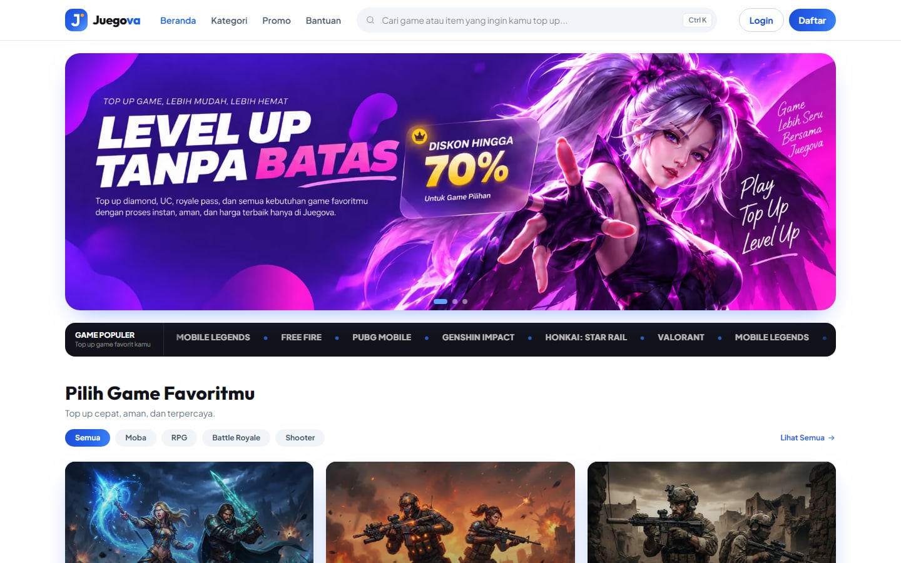
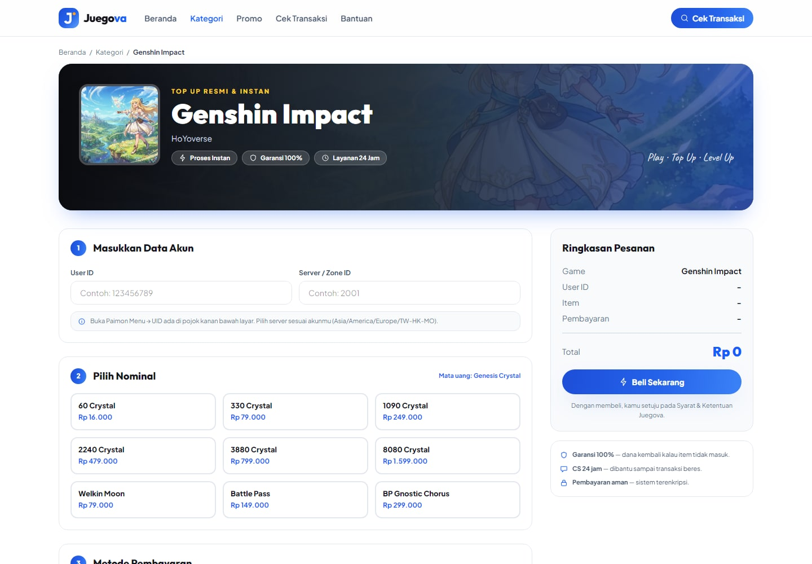
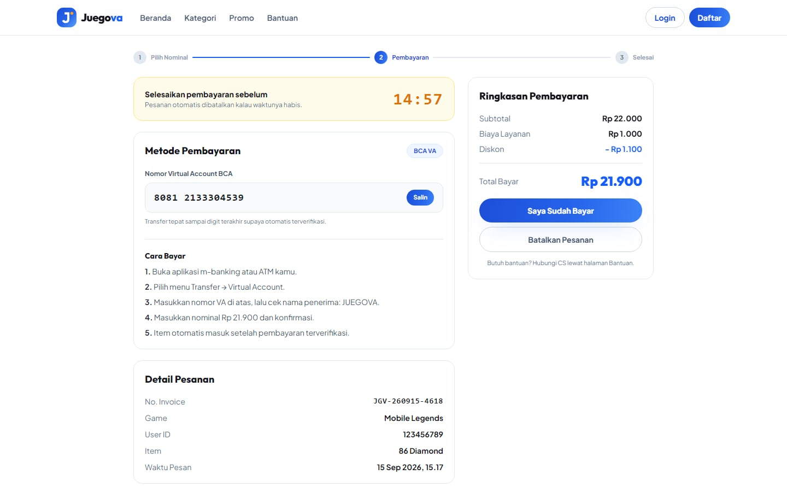
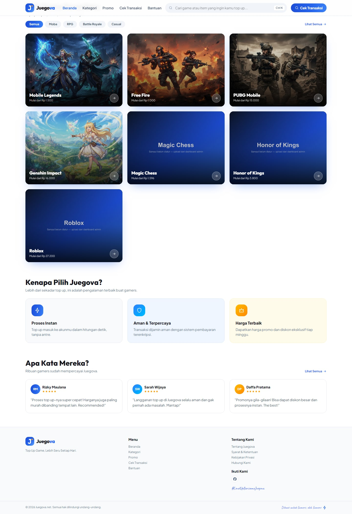
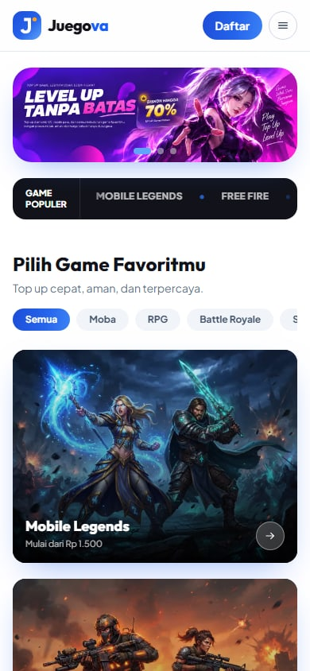
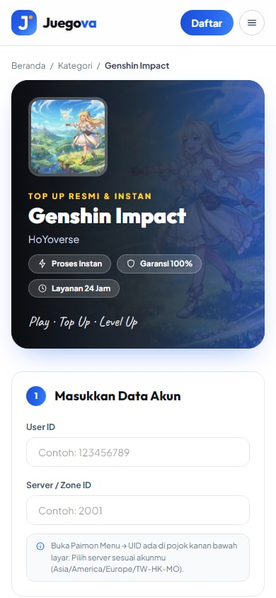
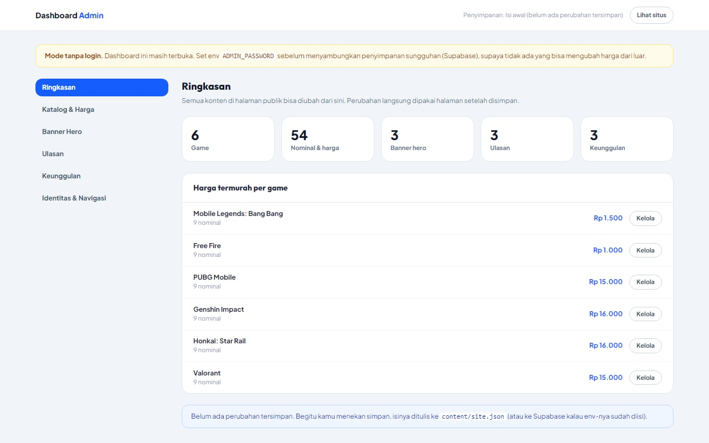
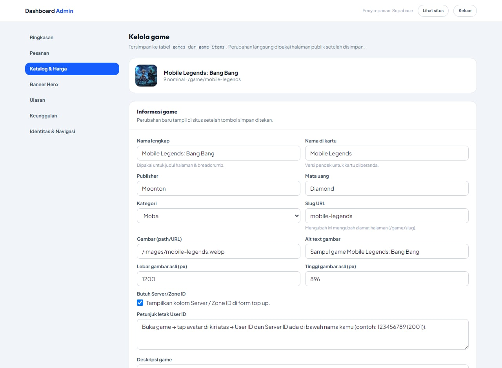

<div align="center">

# Juegova

**Top up game, lebih seru setiap hari.**

A production-ready game top-up storefront — 6 game catalogs, a 3-step checkout flow, and an admin dashboard that drives every piece of public content.

[](https://nextjs.org)
[](https://react.dev)
[](https://www.typescriptlang.org)
[](https://tailwindcss.com)
[](https://motion.dev)
[](#routing--rendering)



</div>

---

## Overview

Juegova is a storefront where gamers top up in-game currency (Diamonds, UC, Genesis Crystals, VP). The customer flow is three steps: pick a game, enter the in-game account ID, then choose a denomination and a payment method.

Everything the customer sees — prices, banners, testimonials, navigation, even the brand name in the logo — is editable from a built-in admin dashboard at `/admin`, without touching code or redeploying.

This repository is a **migration from a hand-written static site** — three standalone HTML files with a CDN-loaded Tailwind build — into a typed, component-driven Next.js application. The visual identity (colours, typography, spacing, gradients, motion) was carried over deliberately, not redesigned.

## Screenshots

| Game detail | Checkout |
| :---: | :---: |
|  |  |

| Home (full page) | Mobile |
| :---: | :---: |
|  |   |

## Admin dashboard

| Overview | Editing a game & its prices |
| :---: | :---: |
|  |  |

Available at `/admin`. What can be managed:

| Section | What it controls |
| --- | --- |
| Katalog & Harga | Games, publishers, categories, artwork, plus every denomination and price. Add, reorder, or delete games and price tiers. |
| Banner Hero | The home page slider — image, alt text, link, and slide order. |
| Ulasan | The overall rating, the home testimonials, and the reviews shown on game pages. |
| Keunggulan | The “why choose us” cards, the badge pills on game banners, and the guarantee points on the game and checkout pages. |
| Identitas & Navigasi | Brand name, tagline, description, contact details, social links, section headings, categories, and both menus. |

### How content is stored

The whole site is a **single JSON document** rather than dozens of relational tables. That keeps the storage layer swappable and the page code untouched when the backend changes. Resolution order:

1. **Supabase** — when `SUPABASE_URL` and `SUPABASE_SERVICE_ROLE_KEY` are set
2. **`content/site.json`** — written by the dashboard (works locally; on a serverless host with a read-only filesystem, writes fail with an explicit message)
3. **`data/*.ts`** — the typed defaults, used before anything has been saved

Saves are recursive merges, so a form can submit only its own slice — `{ navigation: { header: [...] } }` does not wipe the footer menus.

Editing a price revalidates the cached content, so public pages pick up the change on the next request. Game pages stay statically generated; the checkout page stays dynamic.

### Connecting Supabase

The Supabase adapter talks to the REST API directly (no extra dependency). Create one table and fill in two environment variables:

```sql
create table if not exists site_content (
  id text primary key,
  data jsonb not null,
  updated_at timestamptz not null default now()
);
```

```bash
SUPABASE_URL=https://xxxx.supabase.co
# Service role key. Bisa JWT lama (service_role) atau secret key baru (sb_secret_...).
SUPABASE_SERVICE_ROLE_KEY=...
```

The table is locked down: RLS is enabled, access for `anon` and `authenticated` is revoked, and only `service_role` is granted — so the publishable key cannot read or write the content.

### Admin login

Login is **off until you turn it on**. Set `ADMIN_PASSWORD` and `/admin` immediately requires a session; without it the dashboard is open, and it shows a warning banner saying so.

> Set `ADMIN_PASSWORD` **before** connecting Supabase. While the file store is in use, a serverless deployment cannot persist writes anyway, so an open dashboard is harmless. Once Supabase is connected, writes are real and the dashboard must not be public.

Sessions are `httpOnly` cookies signed with HMAC-SHA256, compared with `timingSafeEqual`. `/admin` is also disallowed in `robots.txt`.

## Features

**Customer-facing**

- Hero carousel with autoplay, looping and clickable pagination
- Live game search with keyboard shortcut (<kbd>Ctrl</kbd>+<kbd>K</kbd>)
- Working category filter derived from the catalog (empty categories never render)
- Three-step checkout with inline validation
- Payment instructions that adapt per method — QRIS / e-wallet shows a QR, bank transfer shows a virtual account number with copy-to-clipboard, Alfamart shows a retail code
- 15-minute payment countdown with an expiry state
- Success modal, dismissible with <kbd>Esc</kbd> or a backdrop click

**Engineering**

- TypeScript `strict` with zero `any`
- Adding a game, a price tier, a banner or a testimonial is a dashboard action — no layout changes needed
- Icon names are a union type (`IconName`), so a typo fails the build instead of rendering an empty box
- Fully responsive, verified at 390 / 768 / 1440 px

## Engineering notes

A few decisions worth calling out, because they are the parts that were not obvious.

### Routing & rendering

Game pages live at `/game/[slug]` and are **statically prerendered** via `generateStaticParams`. The checkout page reads `searchParams`, so it is server-rendered on demand and marked `noindex`. The dashboard is explicitly `force-dynamic`, because a cached admin view would show stale prices.

The original site used `/game?id=xxx`. Those URLs are still live in the wild, so `middleware.ts` issues a `308` to the clean path. Redirects in `next.config` were not usable here: Next always carries the source query string into the destination, which produced `/game/valorant?id=valorant`. Middleware can strip just the `id` parameter while preserving analytics parameters such as `utm_source`.

### Verifying a migration instead of eyeballing it

"The design looks the same" is not a test. To prove visual parity, both the original HTML and the Next build were rendered in headless Chrome at identical viewports, and a script compared **every text run and every image** — position, size, font size, weight, colour, line height — plus section-level background, gradient and shadow values.

That surfaced five real defects:

1. **Scroll-reveal content was permanently invisible under `prefers-reduced-motion`.** Framer Motion skips the `whileInView` animation but leaves the `opacity: 0` initial state, so anyone with reduced motion enabled saw empty sections. Fixed with a `matchMedia`-backed hook plus a CSS safety net that wins over inline styles.
2. **`group-hover:grad` never generated CSS.** The original HTML applied a custom class where a Tailwind utility was expected, so the card hover effect silently did nothing. Solved by re-declaring the gradient as a real `@utility`, which also makes every variant work.
3. **A breadcrumb lost its whitespace.** JSX strips whitespace adjacent to newlines, so the separators rendered 4px off. Invisible to the eye; obvious to a diff.
4. **Duplicate SVG gradient IDs.** The header and footer both used `id="jg"`, which is invalid HTML. Now unique per instance.
5. **The hero slider broke when the slide count became dynamic.** Moving from static percentage classes to a computed transform shifted every slide, because a percentage translate resolves against the track's own width. Caught by re-running the diff.

### Accessibility

- The icon set is inline SVG with `aria-hidden`, replacing emoji — emoji render differently on every platform and cannot inherit `currentColor`.
- Decorative icons are hidden from assistive tech; the rating row carries a single `role="img"` label instead of reading "star star star star star".
- Carousel, search, filters, tabs and modal are all keyboard operable, with `aria-current`, `aria-pressed` and `aria-expanded` set.
- The home and checkout pages had **no `<h1>` at all** in the original markup. Each now has exactly one, visually hidden so the design is untouched.

### Assets

Source artwork was 19.1 MB of PNG. Converted to WebP it is **1.7 MB** (−91%) with no visible difference, and `next/image` still negotiates AVIF at request time. The social card is a separate 1200×630 JPEG because Facebook and Twitter do not reliably render WebP previews.

Fonts are loaded through `next/font/local`. Only the weights actually present in the markup are declared — the source contained italic, thin and light files that no element ever used.

## Tech stack

| Layer | Choice |
| --- | --- |
| Framework | Next.js 15 (App Router) |
| Language | TypeScript, `strict` |
| Styling | Tailwind CSS v4 — CSS-first config, one styling method across the project |
| Animation | Framer Motion (scroll reveals, respecting reduced motion) |
| Images | `next/image`, AVIF/WebP negotiation |
| Fonts | `next/font/local` (Outfit, Plus Jakarta Sans, Caveat) |
| SEO | Metadata API, JSON-LD, generated `sitemap.xml` and `robots.txt` |
| Content | Single JSON document — `data/*.ts` defaults, `content/site.json` overrides, optional Supabase |
| Admin auth | HMAC-signed `httpOnly` cookie, no external dependency |

## SEO & metadata

- Per-page `title` / `description` / canonical / OpenGraph / Twitter card through the Metadata API
- JSON-LD: `Organization`, `WebSite` and `ItemList` on the home page; `Product` (with `AggregateOffer` and `AggregateRating`) and `BreadcrumbList` on each game page
- `sitemap.xml` and `robots.txt` generated from the same content source as the pages, so they cannot drift
- The checkout page and the dashboard are `noindex` and excluded from the sitemap
- Every image has descriptive `alt` text; heading order is `h1 → h2 → h3` with no skipped levels

## Getting started

```bash
npm install
npm run dev      # http://localhost:3000
```

The dashboard is at http://localhost:3000/admin.

```bash
npm run build      # production build
npm run start      # serve the production build
npm run typecheck  # tsc --noEmit
```

## Environment

| Variable | Default | Purpose |
| --- | --- | --- |
| `NEXT_PUBLIC_SITE_URL` | Vercel's production domain, else `https://juegova.net` | Canonical origin used by metadata, the sitemap and `robots.txt`. |
| `ADMIN_PASSWORD` | *(unset — dashboard is open)* | Enables the login gate on `/admin`. |
| `ADMIN_SESSION_SECRET` | derived from `ADMIN_PASSWORD` | Set it to invalidate existing sessions without changing the password. |
| `SUPABASE_URL` | *(unset)* | Switches content storage to Supabase. |
| `SUPABASE_SERVICE_ROLE_KEY` | *(unset)* | Server-side key for the content table. |

## Project structure

```
app/
  layout.tsx                root layout, fonts, global metadata
  page.tsx                  home
  game/[slug]/page.tsx      game detail (SSG, generateStaticParams)
  pembayaran/page.tsx       checkout (dynamic, noindex)
  admin/
    login/                  login page (no shell, no guard)
    (dashboard)/            sidebar shell + auth guard, all editors
  sitemap.ts robots.ts      generated crawler files
  not-found.tsx             branded 404
components/
  layout/                   header, footer, logo, search, mobile nav
  home/                     hero slider, marquee, catalog, testimonials
  game/                     banner, top-up flow, order summary
  payment/                  stepper, countdown, instructions, QR
  admin/                    form primitives, list editors, game editor
  ui/                       icon set, reveal, avatar, stars, JSON-LD
data/                       typed default content (seed)
lib/
  content/                  content store + defaults
  admin/                    auth helpers
  ...                       site config, metadata, JSON-LD, pricing
types/                      shared domain types
middleware.ts               legacy /game?id= → /game/[slug] redirect
```

## Placeholders & roadmap

This build is front-end complete. These pieces need real values or a backend before going live:

- **Payment gateway.** The QR is a deterministic decorative pattern, not a scannable code, and the virtual account numbers are generated client-side. Prices also arrive from the order form and must be re-validated server-side.
- **Customer accounts.** The Login and Register buttons in the header are still inert.
- **Newsletter.** The form reports success locally; no endpoint is wired up.
- **WhatsApp.** The dashboard can store a support number, but nothing on the site links to it yet — that needs a contact section or a floating button.

## Author

Built by [@ersetdigital-sudo](https://github.com/ersetdigital-sudo).
