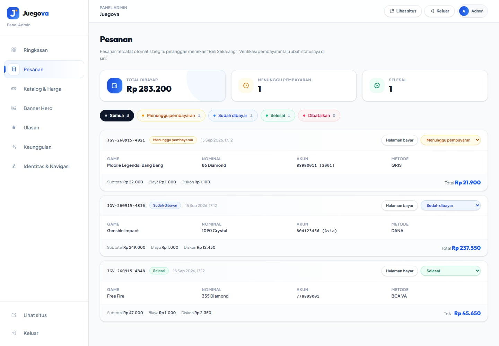
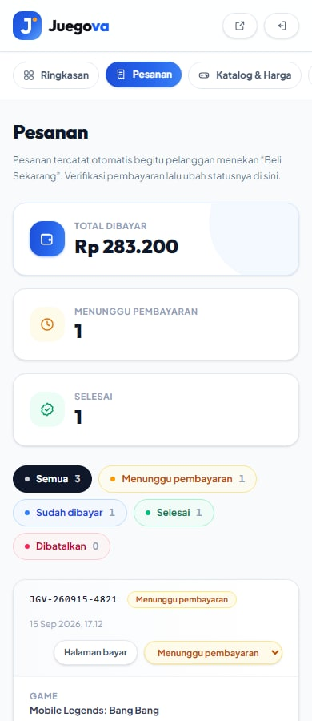

<div align="center">

# Juegova

**Top up game, lebih seru setiap hari.**

A production-ready game top-up storefront — game catalog with per-denomination pricing, a 3-step checkout that writes real orders, and an admin dashboard that drives every piece of public content.

[](https://nextjs.org)
[](https://react.dev)
[](https://www.typescriptlang.org)
[](https://tailwindcss.com)
[](https://supabase.com)
[](#routing--rendering)


</div>

---

## Overview

Juegova is a storefront where gamers top up in-game currency (Diamonds, UC, Genesis Crystals, VP). The customer flow is three steps: pick a game, enter the in-game account ID, then choose a denomination and a payment method.

Every order is recorded in Postgres. Every price, banner, testimonial and menu item is editable from a built-in dashboard at `/admin` — no code changes, no redeploys.

This repository is a **migration from a hand-written static site** — three standalone HTML files with a CDN-loaded Tailwind build — into a typed, component-driven Next.js application. The visual identity (colours, typography, spacing, gradients, motion) was carried over deliberately, not redesigned.

## Screenshots

| Game detail | Checkout |
| :---: | :---: |
|  |  |

| Home (full page) | Mobile |
| :---: | :---: |
|  |   |

## Data model

Four tables. Catalog and orders are **relational**, because they are operational data: you want to query a price, sort orders, or fix a row directly in the Supabase table editor. Presentation content is a **single JSON document**, because nobody queries "all testimonials where…" and it keeps that part of the admin model-free.

| Table | Rows | Purpose |
| --- | --- | --- |
| `games` | 1 per game | name, publisher, category, artwork, ID hint, description, order |
| `game_items` | 1 per denomination | `game_id` → games, label, price, order |
| `orders` | 1 per order | invoice, game, item, account, payment method, totals, status |
| `site_content` | 1 row (`id = 'main'`) | JSON: brand settings, banners, testimonials, features, navigation |

```sql
create table public.games (
  id text primary key, name text not null, card_title text not null,
  publisher text not null default '', currency text not null default '',
  category text not null default '', image text not null default '',
  image_width int not null default 1200, image_height int not null default 896,
  image_alt text not null default '', needs_zone boolean not null default false,
  id_hint text not null default '', description text not null default '',
  sort_order int not null default 0, is_active boolean not null default true,
  created_at timestamptz not null default now(),
  updated_at timestamptz not null default now()
);

create table public.game_items (
  id uuid primary key default gen_random_uuid(),
  game_id text not null references public.games(id) on delete cascade,
  label text not null, price integer not null check (price >= 0),
  sort_order int not null default 0, is_active boolean not null default true,
  created_at timestamptz not null default now()
);

create table public.orders (
  id uuid primary key default gen_random_uuid(),
  invoice text not null unique, game_id text, game_name text not null,
  item_label text not null, account_id text not null, payment_method text not null,
  subtotal integer not null, fee integer not null default 0,
  discount integer not null default 0, total integer not null,
  status text not null default 'menunggu',
  created_at timestamptz not null default now(),
  updated_at timestamptz not null default now()
);

create table public.site_content (
  id text primary key, data jsonb not null,
  updated_at timestamptz not null default now()
);

alter table public.games       enable row level security;
alter table public.game_items  enable row level security;
alter table public.orders      enable row level security;
alter table public.site_content enable row level security;

revoke all on public.games, public.game_items, public.orders, public.site_content
  from anon, authenticated;
grant all on public.games, public.game_items, public.orders, public.site_content
  to service_role;
```

**Access is server-only.** RLS is on, `anon` and `authenticated` are revoked, and only `service_role` is granted. The publishable key — the only key safe to ship to a browser — gets `401` on both read and write.

Without Supabase configured, everything falls back to JSON files under `content/` so `npm run dev` works offline; the shipped defaults live in `data/*.ts` and are type-checked.

### Orders

An order is created the moment a customer presses **Beli Sekarang**, before any payment happens:

- **The price is never sent from the browser.** The client sends only the game id and the denomination label; the server looks the price up in `game_items` and computes the fee and discount. Changing `?price=1` in the URL does nothing.
- The customer lands on `/pembayaran/[invoice]`, which reads the order back from the database — so the page, the totals and the 15-minute countdown (measured from `created_at`, not from page load) are all driven by the stored row.
- **Saya Sudah Bayar** moves `menunggu → dibayar`. That is a claim, not a verification; the transition is guarded so the public page cannot touch an order that is already processed. Only the dashboard can move an order to `selesai` or `batal`.

| Status | Meaning |
| --- | --- |
| `menunggu` | Order created, waiting for payment |
| `dibayar` | Customer says they paid — needs checking against the bank/e-wallet |
| `selesai` | Verified and delivered |
| `batal` | Cancelled or expired |

## Admin dashboard

| Overview | Catalog & prices | Orders |
| :---: | :---: | :---: |
|  |  |  |

<div align="center">

</div>

Available at `/admin`. What can be managed:

| Section | What it controls |
| --- | --- |
| **Pesanan** | Orders with filters per status, revenue total, per-order detail and status changes. |
| **Katalog & Harga** | Games and every denomination/price. Add, reorder or delete games and price tiers. |
| **Banner Hero** | The home page slider — image, alt text, link and order. |
| **Ulasan** | Overall rating, home testimonials, game-page reviews. |
| **Keunggulan** | Feature cards, banner badges, guarantee points, top-up steps. |
| **Identitas & Navigasi** | Brand name, tagline, description, contact, social links, section headings, categories, both menus. |

Saves are recursive merges, so a form submits only its own slice and cannot wipe sibling data. Every save revalidates the content cache, so public pages update on the next request while game pages stay statically generated.

### Admin login

Login is **off until you turn it on**. Set `ADMIN_PASSWORD` and `/admin` immediately requires an HMAC-signed `httpOnly` cookie, compared with `timingSafeEqual`. Without it the dashboard is open and shows a warning banner saying so.

> Set `ADMIN_PASSWORD` **before** connecting Supabase. Once writes are real, an open dashboard means anyone can change your prices.

## Features

**Customer-facing**

- Hero carousel with autoplay, looping and clickable pagination
- Live game search with keyboard shortcut (<kbd>Ctrl</kbd>+<kbd>K</kbd>)
- Category filter derived from the catalog (empty categories never render)
- Three-step checkout with inline validation
- Payment instructions that adapt per method — QRIS / e-wallet shows a QR, bank transfer shows a virtual account number with copy-to-clipboard, Alfamart shows a retail code
- 15-minute payment countdown, measured from the order's creation time
- Success modal, dismissible with <kbd>Esc</kbd> or a backdrop click

**Engineering**

- TypeScript `strict` with zero `any`
- Adding a game or a price tier is a dashboard action
- Icon names are a union type, so a typo fails the build instead of rendering an empty box
- Fully responsive, verified at 390 / 768 / 1440 px

## Engineering notes

### Routing & rendering

Game pages live at `/game/[slug]` and are **statically prerendered** via `generateStaticParams`. The checkout page reads its order from Postgres and is rendered on demand; the dashboard is `force-dynamic`, because a cached admin view would show stale prices.

The original site used `/game?id=xxx`. Those URLs are still live in the wild, so `middleware.ts` issues a `308` to the clean path. Redirects in `next.config` were not usable here: Next always carries the source query string into the destination, which produced `/game/valorant?id=valorant`. Middleware can strip just the `id` parameter while preserving analytics parameters such as `utm_source`.

### Verifying a migration instead of eyeballing it

"The design looks the same" is not a test. Both the original HTML and the Next build were rendered in headless Chrome at identical viewports, and a script compared **every text run and every image** — position, size, font size, weight, colour, line height — plus section-level background, gradient and shadow values. It was re-run after every refactor, including the move to relational tables.

That caught five real defects:

1. **Scroll-reveal content was permanently invisible under `prefers-reduced-motion`.** Framer Motion skips the `whileInView` animation but leaves the `opacity: 0` initial state, so anyone with reduced motion enabled saw empty sections. Fixed with a `matchMedia`-backed hook plus a CSS safety net that wins over inline styles.
2. **`group-hover:grad` never generated CSS.** The original HTML applied a custom class where a Tailwind utility was expected, so the card hover effect silently did nothing. Re-declared as a real `@utility`.
3. **A breadcrumb lost its whitespace.** JSX strips whitespace adjacent to newlines, so the separators rendered 4px off. Invisible to the eye; obvious to a diff.
4. **Duplicate SVG gradient IDs.** The header and footer both used `id="jg"`, which is invalid HTML.
5. **The hero slider broke when the slide count became dynamic.** A percentage translate resolves against the track's own width, so switching from static classes to a computed transform shifted every slide.

### Accessibility

- Inline SVG icon set with `aria-hidden`, replacing emoji — emoji render differently on every platform and cannot inherit `currentColor`.
- The rating row carries a single `role="img"` label instead of reading "star star star star star".
- Carousel, search, filters and modal are keyboard operable, with `aria-current`, `aria-pressed` and `aria-expanded` set.
- The home and checkout pages had **no `<h1>` at all** in the original markup. Each now has exactly one, visually hidden so the design is untouched.

### Assets

Source artwork was 19.1 MB of PNG. As WebP it is **1.7 MB** (−91%) with no visible difference, and `next/image` still negotiates AVIF at request time. The social card is a separate 1200×630 JPEG because Facebook and Twitter do not reliably render WebP previews.

Fonts load through `next/font/local`, and only the weights present in the markup are declared.

## Tech stack

| Layer | Choice |
| --- | --- |
| Framework | Next.js 15 (App Router) |
| Language | TypeScript, `strict` |
| Styling | Tailwind CSS v4 — CSS-first config, one styling method across the project |
| Animation | Framer Motion (scroll reveals, respecting reduced motion) |
| Database | Supabase Postgres, accessed over PostgREST with no extra dependency |
| Images | `next/image`, AVIF/WebP negotiation |
| Fonts | `next/font/local` (Outfit, Plus Jakarta Sans, Caveat) |
| SEO | Metadata API, JSON-LD, generated `sitemap.xml` and `robots.txt` |
| Admin auth | HMAC-signed `httpOnly` cookie, no external dependency |

## SEO & metadata

- Per-page `title` / `description` / canonical / OpenGraph / Twitter card through the Metadata API
- JSON-LD: `Organization`, `WebSite` and `ItemList` on the home page; `Product` (with `AggregateOffer` and `AggregateRating`) and `BreadcrumbList` on each game page
- `sitemap.xml` generated from the same catalog as the pages, so it cannot drift
- Checkout and dashboard are `noindex` and excluded from the sitemap
- Every image has descriptive `alt` text; heading order is `h1 → h2 → h3` with no skipped levels

## Getting started

```bash
npm install
npm run dev      # http://localhost:3000
```

The dashboard is at http://localhost:3000/admin.

```bash
npm run build      # production build
npm run start      # serve the production build
npm run typecheck  # tsc --noEmit
```

## Environment

| Variable | Default | Purpose |
| --- | --- | --- |
| `NEXT_PUBLIC_SITE_URL` | Vercel's production domain, else `https://juegova.net` | Canonical origin for metadata, the sitemap and `robots.txt`. |
| `ADMIN_PASSWORD` | *(unset — dashboard is open)* | Enables the login gate on `/admin`. |
| `ADMIN_SESSION_SECRET` | derived from `ADMIN_PASSWORD` | Set it to invalidate existing sessions without changing the password. |
| `SUPABASE_URL` | *(unset — file storage)* | Switches content and catalog storage to Postgres. |
| `SUPABASE_SERVICE_ROLE_KEY` | *(unset)* | Service role key or `sb_secret_…` key. Server-side only. |

## Project structure

```
app/
  layout.tsx                root layout, fonts, global metadata
  page.tsx                  home
  game/[slug]/page.tsx      game detail (SSG, generateStaticParams)
  pembayaran/[invoice]/     checkout for one order (dynamic, noindex)
  admin/
    login/                  login page (no shell, no guard)
    (dashboard)/            sidebar shell + auth guard, all editors
  sitemap.ts robots.ts      generated crawler files
  not-found.tsx             branded 404
components/
  layout/ home/ game/ payment/   public UI
  admin/                    form primitives, list editors, game editor, order status
  ui/                       icon set, reveal, avatar, stars, JSON-LD
data/                       typed default content (seed)
lib/
  content/                  content store, catalog store, backend config
  orders/                   order store, statuses, checkout actions
  admin/                    auth helpers
  ...                       site config, metadata, JSON-LD, pricing
types/                      shared domain types
middleware.ts               legacy /game?id= → /game/[slug] redirect
```

## Placeholders & roadmap

- **Payment gateway.** The QR is a deterministic decorative pattern, not a scannable code, and the virtual account numbers are generated client-side. Orders are recorded and statuses are managed manually until a gateway is wired up.
- **Customer accounts.** The Login and Register buttons in the header are still inert; orders are not tied to a user.
- **Newsletter.** The form reports success locally; no endpoint is wired up.
- **WhatsApp.** The dashboard can store a support number, but nothing on the site links to it yet.

## Author

Built by [@ersetdigital-sudo](https://github.com/ersetdigital-sudo).
